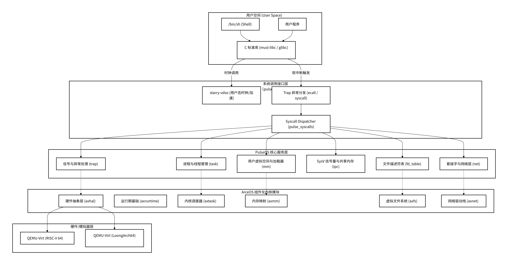

# PulseOS

GitHub 仓库链接: [https://github.com/muou000/PulseOS](https://github.com/muou000/PulseOS)

PulseOS 是一款基于 [ArceOS](https://github.com/arceos-org/arceos) 组件化内核构建的、支持多架构的组件化宏内核操作系统。PulseOS 针对 RISC-V 64 与 LoongArch 64 双架构进行了深度适配与统一抽象，完整实现了进程管理、文件系统、内存管理、信号系统，以及网络模块，旨在提供尽可能与 Linux 兼容的 POSIX 接口。

## 整体架构

PulseOS 的整体软件栈包含用户空间、Trap 异常分发、内核服务与底层的 ArceOS 组件化基础单元：



---

## 仓库结构

```
.
├── Cargo.toml
├── Makefile
├── README.md
├── arceos                     # ArceOS 组件化操作系统内核底座
│   ├── api                    # 对外暴露的内核 API (axfeat等)
│   ├── configs                # 构建配置参数
│   ├── modules                # ArceOS 原生内核组件 (内存分配、同步、驱动等)
│   │   ├── axalloc            # 动态内存分配器
│   │   ├── axdriver           # 外设驱动框架
│   │   ├── axfs               # 虚拟文件系统与设备挂载
│   │   ├── axhal              # 硬件抽象层
│   │   ├── axmm               # 虚拟内存管理与页表映射
│   │   ├── axruntime          # 内核启动与运行期环境
│   │   └── axtask             # 底层执行任务控制与调度
│   └── scripts                # 编译和配置生成辅助脚本
├── crates                     # 第三方定制化依赖及平台组件
│   ├── axplat-loongarch64-qemu-virt # 龙芯 64 平台适配层
│   ├── axplat-riscv64-qemu-virt    # RISC-V 64 平台适配层
│   ├── ext4plus               # 纯 Rust 实现的 ext4 文件系统库
│   └── starry-vdso            # vDSO 机制加速系统调用
├── pulse_core                 # PulseOS 核心库与内核具体功能实现
│   └── src
│       ├── cpu_dma_latency.rs # 处理器 DMA 延迟控制
│       ├── fd_table.rs        # 虚拟文件描述符表与 FdObject 抽象 (VFS)
│       ├── flock.rs           # 文件锁机制实现
│       ├── trap.rs            # 中断异常处理分发
│       ├── ipc                # 进程间通信 (IPC) 模块
│       ├── mm                 # 内存管理扩展
│       ├── net                # 套接字抽象与 TCP/UDP/Netlink 状态机
│       └── task               # 任务控制与管理
├── pulse_syscalls             # 系统调用接口与分派实现
│   └── src
│       ├── handler.rs         # 系统调用统一派发入口
│       └── impls              # 具体系统调用的分类实现
│           ├── fs             # 文件与目录相关系统调用
│           ├── ipc            # 信号量和共享内存系统调用
│           ├── net            # 网络套接字系统调用
│           ├── task           # 进程/线程控制与信号处理系统调用
│           ├── mm.rs          # 内存分配与映射系统调用
│           └── time.rs        # 定时器与时间相关系统调用
├── rootfs                     # 根文件系统内容与覆盖层 (用于生成磁盘镜像)
├── src                        # 仓库根层入口
│   └── main.rs                # 内核主入口
└── records                    # 开发日志、AI 交互记录和过程性产物
```

---

## 内核核心功能实现

- **内存管理 (Memory Management)**:
  - **按需懒分配与写时复制 (COW)**: 采用延迟装载机制，在触发缺页异常时按需分配物理页，并预先映射连续的 3 个页面以减少陷入开销。
  - **TLSF 分配器**: 基于两级分配器架构，通过 TLSF 优化动态内存开销，显著减少内存常驻。
- **进程管理 (Process Management)**:
  - **O(1) 优先级调度**: 采用实时优先级就绪队列，利用位图加速最高优先级查找。
- **文件系统 (Filesystem)**:
  - **多态 VFS**: 抽象出统一的 `FdObject` Trait，无缝对接常规文件、目录、管道、网络套接字等实体。
  - **全 Rust 外部依赖消除**: 选用纯 Rust 的 `ext4plus` 库，避免 C 语言库 FFI 开销与安全缺陷。
- **信号系统 (Signal System)**:
  - **双级信号机制**: 划分进程共享 (`SignalShared`) 与线程局部 (`ThreadSignal`) 信号状态，支持标准 POSIX 信号排队与分发。

---

## PulseOS 优势与亮点

1. **扁平物理页帧元数据管理 (`FrameTable`)**:
   相较于同类系统（如 StarryOS）使用全局锁的 B 树结构，PulseOS 预分配扁平数组 `FrameTable`，实现 O(1) 物理页引用计数查询，且全部基于无锁原子操作更新，极大地消除了并发 `clone` / `fork` 时的锁开销。
2. **安全隔离的用户态拷贝机制**:
   内核不直接解引用用户虚拟地址，而是通过页表翻译后由 `phys_to_virt` 进行内核态物理页的安全拷贝，结合两阶段读写锁与软件缺页懒加载机制，彻底杜绝了内核解引用无效用户地址带来的崩溃隐患。
3. **消除 C 语言依赖的纯 Rust 文件系统**:
   通过使用纯 Rust 实现的 `ext4plus` 库替代 `lwext4` (C 语言库)，消除了跨语言 FFI 性能开销和安全隐患，并且具备良好的异步接口契合度。

---

## 参考项目

本项目在开发和设计过程中参考了以下优秀开源项目：
- **[ArceOS](https://github.com/arceos-org/arceos)**: 核心组件化底座。
- **[StarryOS](https://github.com/os-module/StarryOS)**: 借鉴了部分模块设计。
- **RocketOS**: 借鉴了其批量懒分配的多页映射机制。
- **undefinedOS**: 前期参考了其共享内存多映射设计。
- **[qperf](https://github.com/Starry-OS/qperf)**: 使用该qemu插件进行了性能热点分析与优化。

---

## 如何开始

```bash
make all #构建用于参与测评的镜像
make test #构建带日志的可参与测评的镜像
make run #构建并运行进入shell环境的Riscv PulseOS
make la #快速构建并运行进入shell环境的Loongarch64 PulseOS
make img_all #构建两种架构的rootfs镜像
```

## 注

对于loongarch64 musl对于cyclictest中进程调度相关syscalls的实现不完整，直接在build_img.sh中添加了对应的patch修补libc，使其能调用对应syscalls（由ai实现，详见 [records/ai-logs/Coder/2026-05-02-cyclictest-musl-scheduler.md](records/ai-logs/Coder/2026-05-02-cyclictest-musl-scheduler.md)）