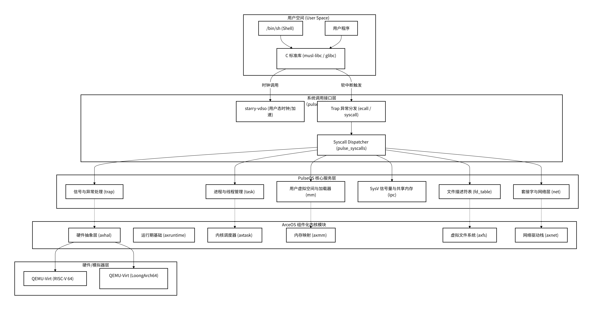

# PulseOS

GitHub 仓库链接: [https://github.com/muou000/PulseOS](https://github.com/muou000/PulseOS)

演示PPT和演示视频见[这里](https://pan.baidu.com/s/1OBeevMPWbBZ45mnfmIVjCA?pwd=XZtN)

PulseOS 是一款基于 [ArceOS](https://github.com/arceos-org/arceos) 组件化内核构建的、支持多架构的组件化宏内核操作系统。PulseOS 针对 RISC-V 64 与 LoongArch 64 双架构进行了深度适配与统一抽象，完整实现了进程管理、文件系统、内存管理、信号系统，以及网络模块，旨在提供尽可能与 Linux 兼容的 POSIX 接口。

## 整体架构

PulseOS 的整体软件栈包含用户空间、Trap 异常分发、内核服务与底层的 ArceOS 组件化基础单元：



---

## 仓库结构

```
.
├── Cargo.toml
├── Cargo.lock
├── Makefile                   #
├── build_img.sh               # 生成 RISC-V 64/LoongArch 64 根文件系统镜像
├── add_apk_to_rootfs.sh
├── src
│   └── main.rs                 # 内核启动与初始用户进程加载
├── arceos                     # ArceOS 内核主体与基础组件
│   ├── api                    # 对外 API（包括 axfeat）
│   ├── configs                # 应用和平台构建配置
│   ├── modules                # 内存、驱动、文件系统、网络和任务等组件
│   ├── examples               # ArceOS 示例程序
│   └── scripts                # ArceOS 构建辅助脚本
├── crates                     # PulseOS 维护或定制的 Rust crate
│   ├── axplat-*               # RISC-V、VisionFive 2 和 LoongArch 平台适配
│   ├── axdriver-*、virtio-drivers # 块设备、网络和 VirtIO 驱动
│   ├── axcpu、axpoll、axsched  # CPU、轮询和调度支持
│   ├── memory_*、page_table_*  # 地址、页表和内存集合管理
│   ├── axfs-ng-vfs、ext4plus    # VFS 与 ext4 文件系统支持
│   ├── axio、smoltcp            # I/O 与网络协议支持
│   └── starry-vdso              # vDSO 支持
├── pulse_core                 # PulseOS 核心内核功能
│   └── src
│       ├── fd_table            # 文件描述符表与 FdObject
│       ├── ipc、mm、net、task  # IPC、内存、网络和任务管理
│       ├── trap.rs             # Trap 与异常分发
│       └── config.rs、flock.rs、record_lock.rs # 核心辅助模块
├── pulse_syscalls             # 系统调用接口与分派
│   └── src
│       ├── handler.rs         # 系统调用统一入口
│       └── impls              # fs、ipc、mm、net、task、time 等实现
├── rootfs                    # 根文件系统构建输入
│   ├── base                   # Alpine minirootfs 基础包
│   ├── extras                 # 测试和工具扩展包
│   └── overlay                # 通用及按架构覆盖文件
├── docs                      # 设计文档、图片和平台移植记录
│   ├── pre、final              # 初赛和决赛设计文档源文件
│   └── visionfive2*.md        # VisionFive 2 相关记录
├── vendor                    # Cargo vendored 依赖
├── bin                       # 本地构建辅助工具
├── .cargo                    # Cargo 构建配置
└── records                   # 开发日志、性能分析和过程性产物
```

---

## 内核核心功能实现

- **内存管理 (Memory Management)**:
  - **按需懒分配与写时复制 (COW)**: 采用延迟装载机制，在触发缺页异常时按需分配物理页，并预先映射连续的 3 个页面以减少陷入开销。
  - **TLSF 分配器**: 基于两级分配器架构，通过 TLSF 优化动态内存开销，显著减少内存常驻。
- **进程管理 (Process Management)**:
  - **O(1) 优先级调度**: 采用实时优先级就绪队列，利用位图加速最高优先级查找。
- **文件系统 (Filesystem)**:
  - **多态 VFS**: 抽象出统一的 `FdObject` Trait，无缝对接常规文件、目录、管道、网络套接字等实体。
  - **全 Rust 外部依赖消除**: 选用纯 Rust 的 `ext4plus` 库，避免 C 语言库 FFI 开销与安全缺陷。
- **信号系统 (Signal System)**:
  - **双级信号机制**: 划分进程共享 (`SignalShared`) 与线程局部 (`ThreadSignal`) 信号状态，支持标准 POSIX 信号排队与分发。

---

## PulseOS 优势与亮点

1. **扁平物理页帧元数据管理 (`FrameTable`)**:
   相较于同类系统（如 StarryOS）使用全局锁的 B 树结构，PulseOS 预分配扁平数组 `FrameTable`，实现 O(1) 物理页引用计数查询，且全部基于无锁原子操作更新，极大地消除了并发 `clone` / `fork` 时的锁开销。
2. **安全隔离的用户态拷贝机制**:
   内核不直接解引用用户虚拟地址，而是通过页表翻译后由 `phys_to_virt` 进行内核态物理页的安全拷贝，结合两阶段读写锁与软件缺页懒加载机制，彻底杜绝了内核解引用无效用户地址带来的崩溃隐患。
3. **消除 C 语言依赖的纯 Rust 文件系统**:
   通过使用纯 Rust 实现的 `ext4plus` 库替代 `lwext4` (C 语言库)，消除了跨语言 FFI 性能开销和安全隐患，并且具备良好的异步接口契合度。

---

## 参考项目

本项目在开发和设计过程中参考了以下优秀开源项目：
- **[ArceOS](https://github.com/arceos-org/arceos)**: 核心组件化底座。
- **[StarryOS](https://github.com/os-module/StarryOS)**: 借鉴了部分模块设计。
- **RocketOS**: 借鉴了其批量懒分配的多页映射机制。
- **undefinedOS**: 前期参考了其共享内存多映射设计。
- **[qperf](https://github.com/Starry-OS/qperf)**: 使用该qemu插件进行了性能热点分析与优化。

---

## 如何开始

```bash
make all #构建用于参与测评的镜像
make test #构建带日志的可参与测评的镜像
make run #构建并运行进入shell环境的Riscv PulseOS
make la #快速构建并运行进入shell环境的Loongarch64 PulseOS
make img_all #构建两种架构的rootfs镜像
make visionfive2 #构建用于VisionFive 2 U-Boot/TFTP启动的镜像
```

## 注

对于loongarch64 musl对于cyclictest中进程调度相关syscalls的实现不完整，直接在build_img.sh中添加了对应的patch修补libc，使其能调用对应syscalls（由ai实现，详见 [records/ai-logs/Coder/2026-05-02-cyclictest-musl-scheduler.md](records/ai-logs/Coder/2026-05-02-cyclictest-musl-scheduler.md)）
