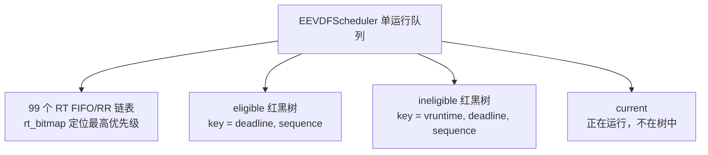
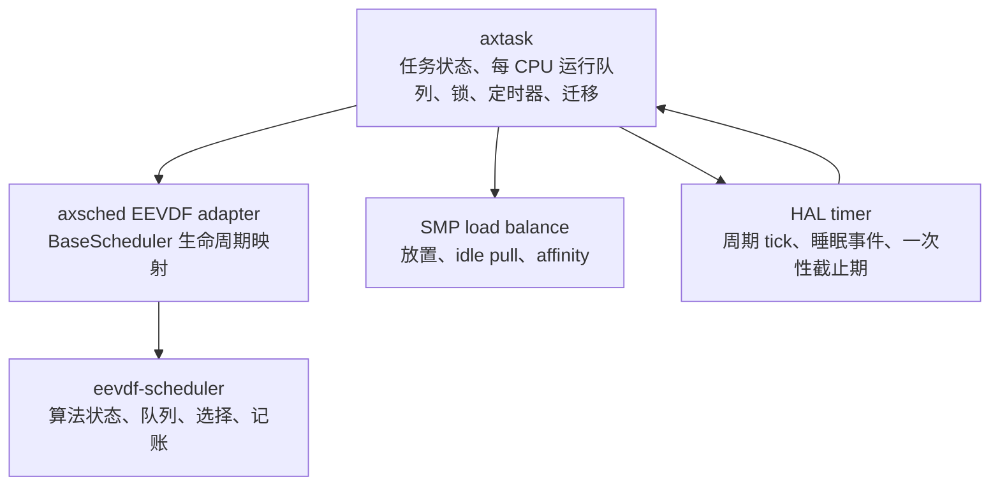

# EEVDF 设计与实现指南

本文档系统讲解 Earliest Eligible Virtual Deadline First（EEVDF）的设计目标、
核心公式、队列算法、任务生命周期，以及 `eevdf-scheduler` crate 在 PulseOS 中的
实际接入方式。阅读本文后，应当能够：

- 解释 EEVDF 为什么同时使用 `vruntime`、lag、eligible 和虚拟截止期；
- 手工推导一次普通任务的入队、选择、运行、抢占、睡眠和迁移过程；
- 理解当前 crate 中两棵红黑树、聚合量和抢占缓存各自解决的问题；
- 正确调用 crate 的生命周期 API，避免重复计时或丢失运行时间；
- 区分 EEVDF、POSIX FIFO/RR、Linux `SCHED_DEADLINE` 和 SMP 负载均衡；
- 明确当前实现与原始 EEVDF、Linux EEVDF 之间的边界。

本文以 crate 0.1.0 的 [`src/eevdf.rs`](../src/eevdf.rs) 为实现基线。

## 1. 先建立整体认识

EEVDF 是一个按权重分配处理器时间的比例公平调度算法。它希望同时解决两个问题：

1. 长时间尺度上，任务获得的 CPU 时间应与其权重成比例；
2. 短时间尺度上，不应只看“谁最缺 CPU”，还要让较短的服务请求更快得到响应。

为此，EEVDF 分两步选择任务：

1. 资格过滤：只考虑当前没有超额获得 CPU 的任务，即 eligible 任务；
2. 截止期排序：在 eligible 任务中选择虚拟截止期最早的任务。

可以把它记成一句话：

> 先用 lag 保证公平资格，再用最早虚拟截止期决定服务顺序。

这里的“截止期”是公平调度算法内部的虚拟截止期，不是应用程序提交的硬实时
deadline，也不等于 Linux `SCHED_DEADLINE`。

## 2. 为什么只比较实际运行时间还不够

假设任务 A 和 B 一直可运行：

- A 的权重是 2048；
- B 的权重是 1024。

它们理想的 CPU 份额是 2:1。如果二者都实际运行 10 ms，表面上运行时间相同，
但 A 只获得了其应得份额的一半。因此调度器需要一种把“实际运行时间”和“任务
权重”统一起来的度量，这就是虚拟运行时间。

权重较大的任务，其虚拟时间走得较慢；权重较小的任务，其虚拟时间走得较快。
这样就能在同一个虚拟时间轴上比较不同优先级任务获得的服务。

## 3. 核心变量和公式

### 3.1 权重

对普通任务，当前 crate 采用 Linux 风格的 40 档 nice 权重表：

- nice 范围：`-20..=19`；
- nice 0 的基准权重：`NICE_0_WEIGHT = 1024`；
- nice 越小，权重越大，应获得的 CPU 份额越多；
- nice 越大，权重越小，虚拟运行时间增长越快。

若同一运行队列上一直有任务集合 `R`，任务 `i` 的理想长期 CPU 份额为：

```text
share_i = w_i / sum(w_j), j in R
```

权重只表示相对比例。例如把所有权重同时乘 2，不改变各任务的理想份额。

### 3.2 虚拟运行时间

任务实际执行 `delta_exec` 纳秒后，crate 按以下公式增加其 `vruntime`：

```text
delta_vruntime_i = delta_exec * NICE_0_WEIGHT / w_i
vruntime_i      += delta_vruntime_i
```

因此：

- nice 0 任务的虚拟时间与实际执行时间等速增长；
- 高权重任务的虚拟时间增长较慢，可以更频繁地获得 CPU；
- 低权重任务的虚拟时间增长较快，需要等待其他任务追上。

实现使用 `u128` 完成中间乘法，并在写回 `u64` 时饱和，避免普通乘法溢出后回绕。

### 3.3 运行队列虚拟时间

当前 crate 用普通任务 `vruntime` 的加权平均定义运行队列虚拟时间 `V`：

```text
V_average = sum(w_i * vruntime_i) / sum(w_i)
V         = max(V_old, V_average)
```

参与计算的任务包括：

- 两棵普通任务树中的全部排队任务；
- 当前正在运行的普通任务。

实时任务不参与普通任务的 `V`。当前任务不在红黑树中，因此计算 `V` 时需要单独
加入当前任务的权重和 `vruntime`。

实现强制 `V` 单调不减。这样，在队列不发生变化且排队任务的 `vruntime` 不变时，
随着当前任务运行，更多 ineligible 任务只会逐渐变为 eligible，而不会反向失去
资格。

### 3.4 lag 与 virtual lag

EEVDF 用 lag 表示任务相对于理想公平服务是“欠服务”还是“超额服务”。从服务量
角度，可以写成：

```text
service_lag_i proportional_to w_i * (V - vruntime_i)
```

当前 crate 实际保存的是去掉权重因子的 virtual lag：

```text
vlag_i = V - vruntime_i
```

因此：

- `vlag > 0`：任务获得的服务偏少，系统欠它 CPU 时间；
- `vlag = 0`：任务位于零 lag 点；
- `vlag < 0`：任务已经超额获得服务，需要暂时等待。

为了避免任务离开很久后带着极端历史债务返回，保存 lag 时会截断到：

```text
-2 * virtual_slice_i <= saved_vlag_i <= 2 * virtual_slice_i
```

### 3.5 eligible：当前是否可被选择

当前实现的资格条件是：

```text
vruntime_i <= V
```

等价地：

```text
vlag_i >= 0
```

必须注意：

> ineligible 不表示任务退出了 EEVDF，也不表示任务阻塞。它仍然是 runnable 的普通
> 任务，只是因为已经超额获得服务，当前暂时不能优先被选择。

随着其他任务运行，`V` 会前进；当 `V` 到达该任务的 `vruntime` 时，任务重新变为
eligible。

### 3.6 request 和虚拟截止期

`BASE_SLICE_NS` 表示一次普通任务 request 的实际时间长度。对于权重 `w_i` 的任务，
对应的虚拟 request 长度为：

```text
virtual_slice_i = BASE_SLICE_NS * NICE_0_WEIGHT / w_i
```

当前虚拟截止期为：

```text
deadline_i = vruntime_i + virtual_slice_i
```

权重较大的任务具有更短的虚拟 request；在其他条件相同时，它的虚拟截止期更早。
但是把虚拟 request 换算回实际执行时间，仍约等于统一的 `BASE_SLICE_NS`。

PulseOS 的 `axtask` 适配当前选择：

```text
BASE_SLICE_NS = 4_000_000 ns = 4 ms
```

crate 本身通过 const 泛型接收这个值，并不强制所有使用者都采用 4 ms。

## 4. EEVDF 的选择规则

普通任务的核心选择过程可以写成：

```text
V = update_virtual_time()

for task in ineligible ordered by vruntime:
    if task.vruntime <= V:
        move task to eligible
    else:
        break

if eligible is not empty:
    return task with minimum (deadline, enqueue_sequence)

if ineligible is not empty:
    return task with minimum (vruntime, deadline, enqueue_sequence)

return None
```

最后一个 fallback 很重要。如果因为离散计算、队列变化或初始化状态导致所有普通
任务暂时都 ineligible，选择最小 `vruntime` 的任务可以让系统继续推进，而不是让
CPU 在存在 runnable 任务时空转。

## 5. 当前 crate 的数据结构

### 5.1 `EEVDFTask<T>`

`EEVDFTask<T>` 包装宿主内核的任务对象 `T`，并保存算法状态：

| 字段 | 含义 |
| --- | --- |
| `priority` | 内部优先级编码，区分普通任务与 RT 任务 |
| `vruntime` | 普通任务累计虚拟运行时间 |
| `deadline` | 当前虚拟 request 的截止期 |
| `exec_start` | 本轮开始运行的单调时钟时间戳 |
| `running` | 是否正在被算法计时 |
| `saved_vlag` | 出队、睡眠或迁移前保存的 virtual lag |
| `lag_vtime` | 保存 lag 时的运行队列虚拟时间 |
| `has_saved_lag` | 是否存在可恢复 lag |
| `queue_id` | 入队序号，用于相同键值时稳定排序 |
| `rt_policy` | RT 任务的 FIFO 或 RoundRobin 策略 |
| `rt_remaining` | RT RoundRobin 的剩余实际时间片 |
| 两个 RBTree link | 分别用于 eligible 和 ineligible 树 |
| `links` | 用于 RT 链表 |

同一任务在同一时刻最多链接到其中一种排队结构。当前正在运行的任务从树或 RT
链表中取出，由调度器的 `current` 字段单独持有。

### 5.2 `EEVDFScheduler<T, BASE_SLICE_NS>`

调度器包含三类主要结构：



普通任务树的排序方式刻意不同：

- `normal_eligible` 按 `(deadline, sequence)` 排序，树首就是应选择的任务；
- `normal_ineligible` 按 `(vruntime, deadline, sequence)` 排序，便于随着 `V` 前进，
  从树首批量提升刚刚获得资格的任务。

`sequence` 从 1 开始循环，避免键完全相同时任务无法共存。排序字段必须在节点从树
中移除后才能修改。

### 5.3 聚合量

为了避免每次计算 `V` 都扫描整棵树，调度器缓存：

```text
normal_total_weight       = sum(w_i)
normal_weighted_vruntime  = sum(w_i * vruntime_i)
normal_task_count         = 排队普通任务数
```

这些缓存只统计正在树中排队的普通任务；当前普通任务在 `update_virtual_time()` 中
临时加入。

这形成一个必须始终成立的不变量：每次普通任务进入或离开树时，任务数、权重和
加权 `vruntime` 必须同步更新。

### 5.4 ineligible deadline 下界和抢占缓存

判断“未来是否会出现比当前 deadline 更早的 eligible 任务”时，ineligible 树按
`vruntime` 而不是 deadline 排序，最坏情况下需要线性寻找候选任务。

当前实现用两层优化降低扫描频率：

1. `normal_ineligible_deadline_lower_bound` 保存 ineligible 集合的 deadline 下界；
2. `normal_preemption_cache` 缓存本次判断结果以及结果失效的 `vruntime` 边界。

deadline 下界在删除节点后允许 stale-low，但绝不能 stale-high：

- stale-low 最多导致一次不必要扫描；
- stale-high 可能错误跳过真正能抢占的任务，破坏正确性。

队列插入或删除会直接清空抢占缓存；当 `V` 到达缓存记录的未来资格边界时，旧缓存
不再覆盖当前状态，下一次检查会重新计算。单纯的资格提升不需要无条件清空仍然安全
的缓存。

## 6. 时间记账

### 6.1 为什么 API 必须携带 `now_ns`

EEVDF 不能只在周期 tick 上增加 `vruntime`。动态 tick、一次性定时器、阻塞和主动
让出都可能让任务在两个 tick 之间停止运行。因此实际记账必须基于单调纳秒时间：

```text
delta_exec = now_ns - exec_start
```

普通任务把它换算为 `delta_vruntime`；RT RoundRobin 任务从 `rt_remaining` 中扣除；
RT FIFO 任务不需要扣减普通任务 `vruntime`。

### 6.2 开始与停止

宿主应遵循以下配对关系：

```text
pick_next_at(now)
    -> on_task_start(task, now)
    -> task executes
    -> tick_at / candidate_preempts 可进行中途记账
    -> on_task_stop(task, later)
```

`account_runtime(now, keep_running)` 使用 `exec_start.swap(now)`，所以在任务保持运行时
可以多次安全地按增量记账。停止时将 `running` 清零，防止同一时间段被重复计算。

如果宿主漏掉 `on_task_stop()`，任务的最后一段运行时间就可能在阻塞、退出或迁移时
丢失；如果对同一执行区间重复 start/stop，则会破坏公平性。

### 6.3 时钟要求

- `now_ns` 必须来自同一单调时钟域；
- 不同 CPU 运行队列之间迁移时，时间戳必须可比较；
- crate 会用 `max(clock_ns, now_ns)` 保证内部时钟不倒退；
- 但错误的倒退时间戳仍会使 `saturating_sub` 得到 0，造成少记账，宿主不能依赖
  饱和运算掩盖时钟错误。

## 7. 五种入队原因

`EnqueueReason` 不是调试标签，而是算法输入。它决定是否恢复 lag、是否续用 request，
以及 RT 任务插入同优先级队列的头部还是尾部。

| 原因 | 普通任务行为 | 典型场景 |
| --- | --- | --- |
| `Spawn` | 按零 lag 放到当前 `V`，创建完整 request | 新任务首次可运行 |
| `Wake` | 恢复并向零衰减保存的 lag，创建完整 request | 阻塞任务被唤醒 |
| `Migration` | 在目标运行队列的 `V` 上恢复 lag，不进行睡眠衰减，创建完整 request | 跨 CPU 移动 runnable 任务 |
| `Preempt` | 记账；未消耗完 request 时保留原 deadline，消耗完后续期 | 非自愿抢占 |
| `Yield` | 主动放弃剩余 request，并强制生成新 deadline | `sched_yield` 或主动让出 |

### 7.1 `Spawn`

新任务没有历史 lag：

```text
lag       = 0
vruntime  = V
deadline  = vruntime + virtual_slice
```

它从零 lag 点加入竞争，不会因为 `vruntime = 0` 而在一个已经运行很久的系统里获得
巨额补偿。

### 7.2 `Wake`

任务阻塞前，调度器保存：

```text
saved_vlag = clamp(V - vruntime)
lag_vtime  = V
```

唤醒时先计算睡眠期间运行队列虚拟时间前进量：

```text
slept_vtime = V_now - lag_vtime
```

然后让正或负 lag 线性向 0 衰减：

```text
saved_vlag > 0: lag = max(saved_vlag - slept_vtime, 0)
saved_vlag < 0: lag = min(saved_vlag + slept_vtime, 0)
```

最终放置：

```text
vruntime = V_now - lag
deadline = vruntime + virtual_slice
```

这避免睡眠任务无限积累正 lag，也避免曾经超额运行的任务永久背负负 lag。

### 7.3 `Migration`

迁移与唤醒一样恢复保存的 lag，但不做睡眠衰减。原因是任务在迁移期间并非主动退出
竞争，迁移不应被当成一次睡眠奖励或惩罚。

当前实现会在目标队列的 `V` 上重建 `vruntime`，所以可以在两个虚拟时间基准不同的
每 CPU 运行队列之间移动任务。

### 7.4 `Preempt`

非自愿抢占先结算已经执行的时间。如果：

```text
vruntime < deadline
```

则保留原 deadline，表示任务之后继续完成尚未用完的 request。如果 request 已经
消耗完，则生成：

```text
deadline = vruntime + virtual_slice
```

### 7.5 `Yield`

主动让出与非自愿抢占不同。若任务当前 eligible，代码把其 `vruntime` 至少推进到
旧 deadline，然后强制创建新 request。这样主动 yield 不会让任务保留一个极早的
旧 deadline，并马上再次压过同伴。

## 8. 普通任务的选择、tick 和抢占

### 8.1 选择下一个任务

`pick_next_at(now_ns)` 的顺序是：

1. 若存在 RT 任务，选择最高 RT 优先级队列的队首；
2. 否则更新普通运行队列 `V`；
3. 将所有 `vruntime <= V` 的 ineligible 任务提升到 eligible 树；
4. 从 eligible 树取最早 deadline；
5. 如果 eligible 为空，从 ineligible 树取最小 `vruntime`。

取出的任务不再计入排队聚合量。宿主随后必须调用 `on_task_start()`。

### 8.2 周期 tick 判断

`tick_at(current, now_ns)` 会先结算从上次记账到 `now_ns` 的执行时间。对普通任务，
按以下优先级请求重调度：

1. 运行队列中出现任何 RT 任务；
2. 当前任务已经到达其虚拟 deadline；
3. 已经 eligible 的排队任务拥有更早 deadline。

如果没有排队普通任务，当前任务到达 deadline 时只会续期，不会进行无意义的自我
切换。

### 8.3 唤醒抢占

新唤醒任务入队后，宿主可调用：

```rust
scheduler.candidate_preempts(&current, &candidate, now_ns)
```

普通任务候选者只有同时满足以下条件才会立即抢占：

```text
candidate.vruntime <= V
and (
    current.vruntime > V
    or candidate.deadline < current.deadline
)
```

也就是：候选任务必须当前可选，并且当前任务已经不具备资格，或者候选任务的虚拟
截止期更早。

### 8.4 一次性抢占定时器

`preemption_deadline(&self, current, now_ns)` 是只读查询，不应改变调度器状态。
对普通任务，它把当前 request 剩余的虚拟时间反算为实际纳秒：

```text
remaining_vruntime = deadline - accounted_vruntime
remaining_ns       = ceil(remaining_vruntime * weight / NICE_0_WEIGHT)
timer_deadline     = now_ns + remaining_ns
```

当前实现只返回当前 request 的到期时间，不返回某个 ineligible 任务未来变为 eligible
的精确边界。未来资格变化仍会在 tick、入队和抢占判断等有状态路径中处理。

保持该查询只读很重要：PulseOS 会在任务切换、唤醒和定时器重编程路径中调用它。
如果查询顺便推进树或填充缓存，会让调用次数影响调度结果，形成时序敏感错误。

## 9. RT FIFO/RR 路径

当前 crate 除普通 EEVDF 外，还包含严格优先级 RT 队列。内部优先级编码是：

| 编码 | 含义 |
| --- | --- |
| `1..=99` | RT，数值越大优先级越高 |
| `-120..=-81` | 普通任务，对应 nice `-20..=19` |
| `-100` | 普通 nice 0，也是新任务默认值 |

调度器维护 99 个链表和一个 `u128` 位图：

```text
queue_index = 99 - rt_priority
```

因此优先级 99 位于索引 0。`trailing_zeros()` 可以常数时间找到最高非空优先级。

### 9.1 FIFO

同优先级 FIFO 任务会持续运行，直到：

- 阻塞；
- 主动 yield；
- 被更高 RT 优先级任务抢占。

被更高优先级任务非自愿抢占后，FIFO 任务回到本优先级队列头部；同优先级任务不会
仅因周期 tick 轮转。

### 9.2 RoundRobin

RT RoundRobin 的固定实际时间片为 50 ms。每次运行会扣减 `rt_remaining`：

- 被更高优先级任务提前抢占时保留剩余时间片，并回到队首；
- 时间片耗尽且存在同优先级同伴时请求轮转；
- yield、wake 或耗尽时间片后回到队尾，并重置时间片。

### 9.3 与 EEVDF 和 `SCHED_DEADLINE` 的关系

- 任意 RT FIFO/RR 任务都优先于普通 EEVDF 任务；
- RT 任务不参与普通任务的 `V`、lag 或 deadline 计算；
- 这里的 RT 队列不是 EDF，也没有 CBS runtime/period admission control；
- PulseOS 当前接受的 `SCHED_DEADLINE` 参数最终仍落入普通调度路径；启用 EEVDF 时
  就是普通 EEVDF 任务，不能提供 Linux `SCHED_DEADLINE` 保证。

## 10. 优先级变化

必须通过 `update_priority_at(task, priority, now_ns)` 修改已经由调度器管理的任务。
直接调用任务上的 `set_priority()` 只适用于尚未入队、尚未运行的任务。

更新流程为：

1. 校验新优先级编码；
2. 若任务正在运行，先按旧权重记账；
3. 若任务正在排队，保存 lag 并从原队列移除；
4. 更新优先级；
5. 普通任务与 RT 任务之间切换时清理不再适用的状态；
6. 排队任务按 `Migration` 语义重新入队。

当前实现对正在运行的普通任务改权重时，把 `vruntime` 重置到当前 `V` 并生成新
deadline。这是一个明确的简化：它没有像当前 Linux EEVDF 那样精确缩放并保留
relative deadline 和 lag。

## 11. 迁移与 SMP 的边界

`EEVDFScheduler` 表示一个运行队列，而不是整个多核系统。crate 提供：

```rust
detach_normal_task(predicate)
enqueue(task, EnqueueReason::Migration, now_ns)
```

用于宿主从源队列选出符合 CPU affinity 等约束的普通任务，并在目标队列恢复 lag。
但 crate 不决定：

- 初次创建任务应放在哪个 CPU；
- 唤醒任务是否留在原 CPU；
- 哪个 CPU 过载或空闲；
- 是否应 work stealing；
- CPU topology、cache locality、NUMA 或能耗策略；
- 迁移期间需要哪些锁和 IPI。

这些都属于宿主内核的 SMP 放置和负载均衡层。局部 EEVDF 公平不能自动消除跨 CPU
负载不均衡。

`detach_normal_task(predicate)` 为了应用宿主谓词，最坏需要扫描普通任务树。它只
迁移排队普通任务，不会迁移当前正在运行的任务或 RT 任务。

## 12. crate、`axsched` 与 `axtask` 的分层

PulseOS 中的调用关系如下：



职责划分如下：

### `eevdf-scheduler`

- 定义 `EEVDFTask<T>`、`EEVDFScheduler`、`EnqueueReason` 和 `RtPolicy`；
- 实现普通 EEVDF 与 RT FIFO/RR 算法；
- 只依赖 `alloc`、侵入式树和侵入式链表；
- 不依赖 `axsched::BaseScheduler`；
- 不负责锁、中断、CPU 选择和硬件定时器。

### `axsched`

- 将 `SchedEnqueueReason` 一一映射到 crate 的 `EnqueueReason`；
- 为 `EEVDFScheduler` 实现 `BaseScheduler`；
- 转发 start、stop、tick、抢占、deadline 和优先级更新；
- 不复制 EEVDF 算法细节。

### `axtask`

- 在任务状态转换时确定 Spawn/Wake/Yield/Preempt/Migration；
- 在调度器锁内调用算法；
- 任务切换前后调用 `task_stopped` 和 `task_started`；
- 将 scheduler deadline 与周期 tick、睡眠定时器、future timer 合并；
- 设置 `preempt_pending`，执行实际上下文切换；
- 维护每 CPU 运行队列和跨 CPU idle pull。

这种边界使独立 crate 可以由其他内核接入，而不必采用 PulseOS 的任务结构或
`BaseScheduler` trait。

## 13. 两个手工推导演示

### 13.1 三个同权重任务

设 A、B、C 都是 nice 0，`BASE_SLICE_NS = 4 ms`，初始 `V = 0`。

初次入队：

| 任务 | `vruntime` | `deadline` | eligible |
| --- | ---: | ---: | --- |
| A | 0 | 4 ms | 是 |
| B | 0 | 4 ms | 是 |
| C | 0 | 4 ms | 是 |

deadline 相同，按入队序号先选 A。A 运行 4 ms 后：

```text
vruntime_A = 4 ms
V = (4 + 0 + 0) / 3 = 1.333 ms
```

A 已经位于 `V` 前方，暂时 ineligible；B、C 仍 eligible。接下来选择 B。B 也运行
4 ms 后：

```text
V = (4 + 4 + 0) / 3 = 2.667 ms
```

此时只剩 C eligible。C 运行后，三者 `vruntime` 都达到 4 ms，`V` 达到 4 ms，
A、B 又重新获得资格。长期运行形成近似轮转，但它是由 lag 和 deadline 推导出来，
而不是固定任务数组上的机械 RR。

### 13.2 不同权重任务

设：

- A 为 nice -5，权重 3121；
- B 为 nice 0，权重 1024；
- base slice 为 4 ms。

理想长期份额约为：

```text
A: 3121 / (3121 + 1024) = 75.3%
B: 1024 / (3121 + 1024) = 24.7%
```

二者的虚拟 request 为：

```text
A: 4 ms * 1024 / 3121 = 约 1.312 virtual ms
B: 4 ms * 1024 / 1024 = 4 virtual ms
```

A 每实际运行 4 ms，只消耗约 1.312 ms 的虚拟时间，因此其虚拟 deadline 更密集，
也会比 B 更频繁获得 request。长期累计后，实际运行时间趋近权重比例。

## 14. 复杂度

令 `n` 为普通排队任务数，`k` 为本轮刚刚从 ineligible 提升到 eligible 的任务数。

| 操作 | 典型复杂度 | 说明 |
| --- | --- | --- |
| 普通任务插入 | `O(log n)` | 插入对应红黑树 |
| eligible 任务选择 | `O(log n)` 删除 | 树首就是最早 deadline |
| 资格提升 | `O(k log n)` | 每个任务从一棵树移动到另一棵树；跨运行过程可摊销 |
| 已知普通任务删除 | `O(log n)` 量级 | 通过侵入式节点定位后维护红黑树 |
| RT 最高优先级定位 | `O(1)` | 位图 `trailing_zeros` |
| RT 同优先级插入/取出 | `O(1)` | 侵入式链表 |
| predicate 迁移选择 | 最坏 `O(n)` | 需要寻找满足 affinity 等条件的任务 |
| ineligible 抢占候选检查 | 最坏 `O(n)` | 下界和缓存可跳过大量重复扫描 |

两棵树的设计偏向实现清晰和快速取得当前答案。Linux 当前使用一棵带
`min_vruntime` 等子树信息的增广红黑树，可以在不物理搬运 eligible/ineligible
节点的情况下进行剪枝查找。

## 15. 正确接入 crate 的最小流程

下面是单运行队列宿主的最小生命周期示意：

```rust
use alloc::sync::Arc;
use eevdf_scheduler::{EEVDFScheduler, EEVDFTask, EnqueueReason};

const BASE_SLICE_NS: u64 = 4_000_000;
type Task = EEVDFTask<MyKernelTask>;
type Scheduler = EEVDFScheduler<MyKernelTask, BASE_SLICE_NS>;

let mut scheduler = Scheduler::new();
let task = Arc::new(Task::new(my_task));

// 首次成为 runnable。
scheduler.enqueue(task.clone(), EnqueueReason::Spawn, now_ns());

// 在运行队列锁内选择，取出后标记开始运行。
let current = scheduler.pick_next_at(now_ns()).unwrap();
scheduler.on_task_start(&current, now_ns());

// tick 或一次性定时器到达。
if scheduler.tick_at(&current, now_ns()) {
    request_reschedule();
}

// 真正停止运行时结算最后一段时间。
scheduler.on_task_stop(&current, now_ns());

// 非自愿抢占后保留未完成 request。
scheduler.enqueue(current, EnqueueReason::Preempt, now_ns());
```

宿主必须额外保证：

1. 所有修改同一 `EEVDFScheduler` 的操作都被同一个运行队列锁串行化；
2. 一个任务不能同时插入两个运行队列，也不能重复入队；
3. 红黑树键字段只能在节点未链接时修改；
4. `pick_next_at()` 取出的非 idle 任务必须与一次 `on_task_start()` 对应；
5. block、exit、yield、preempt 和 migration 前必须结算当前执行区间；
6. `preemption_deadline()` 只是查询，不能替代 `tick_at()` 的有状态记账；
7. `queued_is_empty()` 只表示没有等待任务，不代表当前 CPU 没有正在运行的任务。

crate 的原子字段不能替代运行队列锁。`&mut self` 保证调度器结构的独占修改，而
`Atomic*` 主要服务于任务状态访问和侵入式结构要求。

## 16. 当前实现与 Linux EEVDF 的差异

当前 crate 实现了 EEVDF 核心选择规则，但不是 Linux `fair_sched_class` 的等价实现。
关键差异包括：

| 维度 | 当前 crate | Linux EEVDF |
| --- | --- | --- |
| 树结构 | eligible/ineligible 两棵树 | 一棵按 deadline 排序的增广树 |
| slice | 每个调度器使用编译期固定 base slice | 可调 base slice，并支持任务请求自定义 slice |
| 睡眠任务 | 完全出队，保存并线性衰减 lag | 当前实现支持 deferred dequeue，让部分睡眠任务留队消耗负 lag |
| lag 放置 | 在当前 `V` 上直接重建 `vruntime` | 补偿任务重新加入对加权平均 `V` 的影响 |
| 迁移 | 保留 lag，但生成完整新 request | 可保留 relative deadline 和未完成 request |
| 改权重 | 重新放置并刷新 deadline | 缩放并尽量保持 lag、relative deadline 和保护状态 |
| 抢占 | eligible 且 deadline 更早即可抢占 | 还有 RUN_TO_PARITY、PREEMPT_SHORT 等 request 保护策略 |
| 调度层级 | 单运行队列平面任务 | 支持调度组和层级 `sched_entity` |
| SMP | 交给宿主 | 集成 PELT、sched-domain、CPU capacity、NUMA/EAS 等 |
| 调度类 | crate 内组合 EEVDF 与 RT FIFO/RR | fair、rt、deadline 是独立调度类 |

这些差异不意味着当前 crate 没有实现 EEVDF。更准确的定位是：

> 当前 crate 是一个面向 `no_std` 内核、算法边界清晰的 EEVDF 核心与 RT 队列实现；
> 它保留了 PulseOS 所需的生命周期语义，但没有复制 Linux 公平调度器的全部策略和
> 内核基础设施。

进一步提高与 Linux 语义的一致性时，优先级建议是：

1. 迁移时保留 relative deadline 和剩余 request；
2. 对任务重新入队造成的 `V` 变化进行严格 lag 补偿；
3. 改权重时保持 lag 和 deadline；
4. 支持可选 per-task slice 和 request protection；
5. 用增广信息消除 ineligible 抢占候选的最坏线性扫描；
6. 若目标是纯 EEVDF crate，再把 RT FIFO/RR 组合移到宿主调度框架。

PELT、cgroup、CFS bandwidth、NUMA、EAS 和 CPUFreq 不属于独立 EEVDF 算法核心，
不建议为了“像 Linux”而全部加入这个 crate。

## 17. 常见误解

### “ineligible 任务无法进行 EEVDF 调度”

错误。它仍由 EEVDF 管理且仍是 runnable，只是当前暂时不可被选中。

### “deadline 越早就是 Linux `SCHED_DEADLINE`”

错误。EEVDF 的 deadline 位于虚拟时间域，用于普通任务公平排序；
`SCHED_DEADLINE` 使用实际 runtime/deadline/period，并需要 CBS/EDF 语义。

### “EEVDF 可以自动解决多核负载不均衡”

错误。EEVDF 在单运行队列内决定“这个 CPU 下一步运行谁”；任务放到哪个 CPU、
何时迁移和如何 work stealing 是另一个问题。

### “nice 越高，任务每次实际运行的时间片就一定越短”

当前 crate 不是这样。不同权重改变的是虚拟 request 和 `vruntime` 增速；把剩余虚拟
request 换回实际时间后，单次 request 仍约为统一 base slice。

### “只在 tick 中记账就够了”

错误。任务可能在 tick 间隔内阻塞、退出、yield 或迁移，所以所有停止执行的路径
都必须按单调纳秒时间完成最后一次记账。

### “`preemption_deadline()` 会顺便更新调度器”

错误。该接口有意是只读的。资格提升和 runtime 记账应在 enqueue、tick、stop、
preemption 判断等有状态路径完成。

## 18. 测试设计

crate 的单元测试集中在 `src/eevdf.rs`，覆盖以下类别：

- eligibility 过滤、最早 deadline 和全部 ineligible 时的 fallback；
- 两棵树之间的资格提升和侵入式节点重新入队；
- 聚合权重、加权 `vruntime`、任务计数和下界不变量；
- 抢占缓存的命中、失效和未来 eligibility 边界；
- `preemption_deadline()` 的只读性和未记账 runtime 换算；
- yield 放弃 request、wake 抢占、睡眠 lag 衰减和迁移 lag 重基准；
- nice 权重比例和预计算 virtual slice；
- 优先级编码、改优先级、普通/RT 状态切换；
- RT 优先级、同优先级 RR 轮转和 FIFO 不轮转；
- 饱和算术和极端数值边界。

独立 crate 验证：

```bash
cd crates/eevdf-scheduler
cargo test
cargo check --lib
```

PulseOS 集成验证应从仓库根目录使用统一构建入口：

```bash
set -o pipefail
make test 2>&1 | tail -30
```

如需明确验证 EEVDF 与负载均衡的组合配置，应按当前 Makefile 的 feature 约定传入
完整列表，而不是假设增量追加：

```bash
set -o pipefail
make test FEATURE=final-testcode,sched-eevdf,sched-load-balance 2>&1 | tail -30
```

构建通过只能证明源码和双架构配置可编译。调度公平性、尾延迟或吞吐提升需要单独的
运行时测试；性能结论还必须使用相同提交、CPU 数、镜像、日志级别和工作负载进行
重复 A/B 测量。

## 19. 阅读源码的推荐顺序

建议按以下顺序阅读 [`src/eevdf.rs`](../src/eevdf.rs)：

1. `NICE_TO_WEIGHT`、`normal_virtual_slices()` 和 `calc_delta_fair()`；
2. `EEVDFTask` 字段及 `account_runtime()`；
3. 两个 intrusive adapter 的排序键；
4. `EEVDFScheduler` 字段和聚合量；
5. `update_virtual_time()`、`save_lag()`、`place_task()`；
6. `enqueue_at()` 的五种原因；
7. `promote_normal_eligible()` 和 `pick_normal()`；
8. `tick_at()`、`candidate_preempts()`、`preemption_deadline()`；
9. `set_priority_inner()` 和 `detach_normal_task()`；
10. 单元测试，尤其是 migration、sleep、preemption cache 和 RT 测试。

阅读时可以持续检查四个问题：

1. 当前任务的最后一段实际运行时间是否已经记账？
2. 任务现在位于 current、eligible、ineligible、RT queue 还是完全离队？
3. 修改排序键之前，侵入式节点是否已经从树中移除？
4. 普通任务进出队列时，三个聚合量是否同步更新？

## 20. 术语速查

| 术语 | 本文含义 |
| --- | --- |
| actual time | 硬件单调时钟上的实际纳秒时间 |
| virtual time | 按任务权重缩放后的公平时间域 |
| `vruntime` | 单个普通任务累计消耗的虚拟服务时间 |
| `V` | 当前普通运行队列的加权平均虚拟时间，且单调不减 |
| lag | 理想公平服务与实际服务的差额 |
| virtual lag | 当前实现保存的 `V - vruntime` |
| eligible | `vruntime <= V`，普通任务当前可被选择 |
| ineligible | 普通任务仍 runnable，但当前暂不可被选择 |
| request | 一次连续服务预算，当前 crate 通常对应 base slice |
| virtual slice | request 按权重换算后的虚拟时间长度 |
| virtual deadline | `vruntime + virtual_slice`，用于 EEVDF 排序 |
| preemption deadline | 宿主应再次进入调度器检查抢占的实际时钟时刻 |
| RT FIFO/RR | crate 内独立于普通 EEVDF 的严格优先级路径 |
| SMP load balance | 宿主决定任务在哪个 CPU 运行的跨队列策略 |

## 21. 参考资料

- Ion Stoica, Hussein Abdel-Wahab，
  [Earliest Eligible Virtual Deadline First: A Flexible and Accurate Mechanism for Proportional Share Resource Allocation](https://people.eecs.berkeley.edu/~istoica/papers/eevdf-tr-95.pdf)，
  Technical Report 95-22。
- [Linux 内核 EEVDF 官方文档](https://docs.kernel.org/scheduler/sched-eevdf.html)。
- [Linux 7.2 `kernel/sched/fair.c` 对照源码](https://github.com/torvalds/linux/blob/8d3ae59288f1e7d58d76558a6ee96d533bc5019f/kernel/sched/fair.c)。
- 本 crate 的 [`README.md`](../README.md) 和 [`src/eevdf.rs`](../src/eevdf.rs)。
