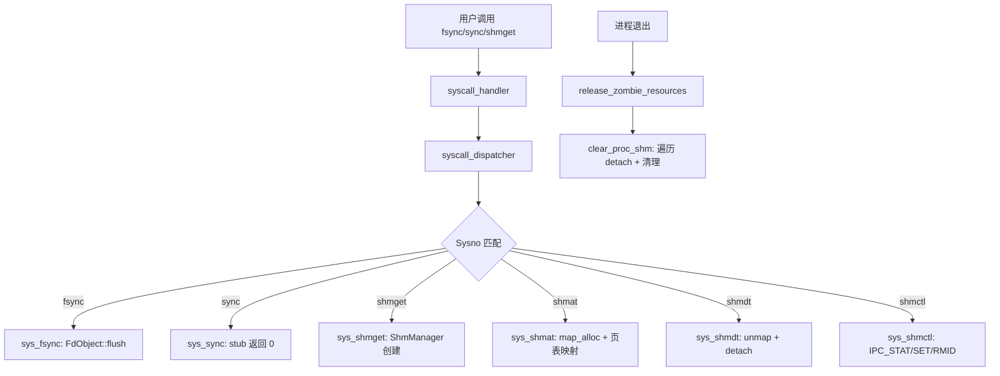

# 实现 fsync / sync / shmget 系统调用

## 概述

为 PulseOS 实现三个系统调用：
1. **fsync** — 将指定 fd 的文件数据刷盘
2. **sync** — 全局文件系统同步（dummy/stub）
3. **shmget / shmat / shmdt / shmctl** — System V 共享内存全套

参考实现：StarryOS (`/home/muou/StarryOS`)，PulseOS 已有基础设施：`FdObject::flush()`、`axfs::File::sync()`、`axmm::AddrSpace::map_alloc/unmap`。

---

## 一、fsync syscall（简单）

### 1.1 在 [`io.rs`](pulse_syscalls/src/impls/fs/io.rs) 中添加 `sys_fsync`

```rust
pub fn sys_fsync(fd: usize) -> isize {
    axlog::debug!("sys_fsync: fd={}", fd);
    let object = match get_fd_entry(fd) {
        Ok(entry) => entry.object,
        Err(e) => return -e.code() as isize,
    };
    match object.flush() {
        Ok(()) => 0,
        Err(e) => -e.code() as isize,
    }
}
```

- 利用已有的 [`FdObject::flush()`](pulse_core/src/fd_table.rs:84)，文件对象会调用 `axfs::File::sync(false)`。
- `get_fd_entry` 已在 `io.rs` 中通过 `use` 引入。

### 1.2 在 [`fs/mod.rs`](pulse_syscalls/src/impls/fs/mod.rs) 中导出

```rust
pub(crate) use io::{..., sys_fsync, ...};
```

### 1.3 在 [`handler.rs`](pulse_syscalls/src/handler.rs) 中分发

```rust
Sysno::fsync => impls::sys_fsync(args[0]),
```

---

## 二、sync syscall（简单 stub）

### 2.1 在 [`io.rs`](pulse_syscalls/src/impls/fs/io.rs) 中添加 `sys_sync`

```rust
pub fn sys_sync() -> isize {
    axlog::debug!("sys_sync (stub)");
    0
}
```

- 与 StarryOS 一致，作为 dummy 实现返回 0。

### 2.2 导出 + 分发

同 fsync，在 `mod.rs` 导出，`handler.rs` 添加 `Sysno::sync => impls::sys_sync()`。

---

## 三、shmget / shmat / shmdt / shmctl（复杂）

### 架构设计

StarryOS 的 shm 实现依赖自定义的 `Backend::Shared(SharedBackend)` 枚举变体和 `SharedPages` 结构。PulseOS 使用的是 arceos 的 `axmm` 模块，其 [`Backend`](arceos/modules/axmm/src/backend/mod.rs:22) 枚举只有 `Linear`、`Alloc`、`File` 三种变体，**没有 `Shared` 变体**。

**方案**：在 `pulse_core` 中实现 shm 管理器，使用 `axmm::Backend::new_alloc(true)` 预分配物理页面，在所有 attach 的进程间共享同一物理页表映射。关键点：

1. 用 `Arc<SharedPages>` 保存共享物理页面地址
2. `shmat` 时用 `aspace.map_alloc()` 分配虚拟地址，然后手动将物理帧映射到页表
3. 进程退出时自动 detach

但考虑到 arceos `Backend` 枚举不可扩展（在 vendor 代码中），**简化方案**：

- **shmget**：创建 `ShmInner`，分配物理页面，返回 shmid
- **shmat**：在目标进程地址空间中用 `map_with_backend(Backend::Alloc{populate:true})` 映射虚拟地址，然后复制物理页内容（首次），后续共享通过页表映射
- 更实际的做法：用 `map_alloc` + `populate:true`，首次 attach 时分配页面，后续 attach 时直接映射相同物理帧

**最终方案（参考 StarryOS，适配 arceos）**：

由于 arceos 的 `Backend` 不支持共享物理帧的直接映射，我们将采用以下策略：

1. 在 `pulse_core/src/ipc/shm.rs` 中管理 `ShmManager`（全局）
2. `ShmInner` 保存 `Vec<PhysAddr>` 物理帧列表
3. `shmat` 时：
   - 用 `aspace.map_alloc(start, size, flags, false)` 分配虚拟空间
   - 遍历页面，手动在页表中映射到已有的物理帧
4. `shmdt` 时：`aspace.unmap(start, size)`
5. 进程退出时自动 detach

### 3.1 创建 [`pulse_core/src/ipc/mod.rs`](pulse_core/src/ipc/mod.rs)

```rust
pub mod shm;
pub use shm::SHM_MANAGER;
```

### 3.2 创建 [`pulse_core/src/ipc/shm.rs`](pulse_core/src/ipc/shm.rs)

核心结构：
- `ShmInner { shmid, key, page_num, phys_pages: Vec<PhysAddr>, rmid, mapping_flags, shmid_ds, va_range: BTreeMap<Pid, (VirtAddr, usize)> }`
- `ShmManager { key_shmid: BTreeMap<i32, i32>, shmid_inner: BTreeMap<i32, Arc<Mutex<ShmInner>>>, pid_shmid_vaddr: BTreeMap<Pid, BTreeMap<i32, (VirtAddr, usize)>>, next_shmid: AtomicI32 }`
- `SHM_MANAGER: Lazy<Mutex<ShmManager>>`
- `pub fn clear_proc_shm(pid: u64)` — 进程退出时调用

### 3.3 修改 [`pulse_core/src/lib.rs`](pulse_core/src/lib.rs)

```rust
pub mod ipc;
```

### 3.4 创建 [`pulse_syscalls/src/impls/ipc/mod.rs`](pulse_syscalls/src/impls/ipc/mod.rs)

```rust
mod shm;
pub(crate) use shm::*;
```

### 3.5 创建 [`pulse_syscalls/src/impls/ipc/shm.rs`](pulse_syscalls/src/impls/ipc/shm.rs)

实现四个系统调用函数：
- `sys_shmget(key: i32, size: usize, shmflg: usize) -> isize`
- `sys_shmat(shmid: i32, shmaddr: usize, shmflg: i32) -> isize`
- `sys_shmdt(shmaddr: usize) -> isize`
- `sys_shmctl(shmid: i32, cmd: i32, buf: usize) -> isize`

### 3.6 修改 [`pulse_syscalls/src/impls/mod.rs`](pulse_syscalls/src/impls/mod.rs)

```rust
mod ipc;
pub(crate) use ipc::*;
```

### 3.7 修改 [`pulse_syscalls/src/handler.rs`](pulse_syscalls/src/handler.rs)

```rust
Sysno::shmget => impls::sys_shmget(args[0] as i32, args[1], args[2]),
Sysno::shmat => impls::sys_shmat(args[0] as i32, args[1], args[2] as i32),
Sysno::shmdt => impls::sys_shmdt(args[0]),
Sysno::shmctl => impls::sys_shmctl(args[0] as i32, args[1] as i32, args[2]),
```

### 3.8 修改进程退出清理

在 [`pulse_core/src/task/process.rs`](pulse_core/src/task/process.rs:1149) 的 `release_zombie_resources` 中添加：

```rust
pulse_core::ipc::clear_proc_shm(self.pid());
```

---

## 四、依赖和注意事项

### Cargo.toml

`pulse_core/Cargo.toml` 可能需要添加 `memory_addr` 依赖（用于物理地址操作），检查是否已存在。

`pulse_syscalls/Cargo.toml` 可能需要添加 `linux-raw-sys` 的 `system` feature（已存在）。

### IPC 常量

需要定义以下常量（参考 linux-raw-sys 或手动定义）：
- `IPC_PRIVATE = 0`
- `IPC_SET = 1`
- `IPC_STAT = 2`
- `IPC_RMID = 0`
- `SHM_RDONLY = 0o10000`
- `SHM_RND = 0o20000`
- `SHM_REMAP = 0o40000`

### ShmidDs 结构

需要在 `pulse_core/src/ipc/shm.rs` 中定义与 Linux 兼容的 `ShmidDs` 结构体（C ABI）。

---

## 五、执行顺序

1. **fsync** — 最简单，直接实现
2. **sync** — stub，直接实现
3. **shmget/shmat/shmdt/shmctl** — 需要新建模块，按以下顺序：
   a. `pulse_core/src/ipc/` 模块和 `ShmManager`
   b. `pulse_syscalls/src/impls/ipc/` 系统调用实现
   c. handler.rs 分发
   d. 进程退出清理

---

## 六、Mermaid 流程图


